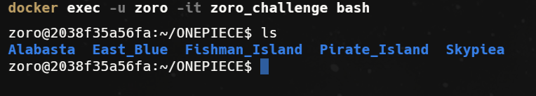
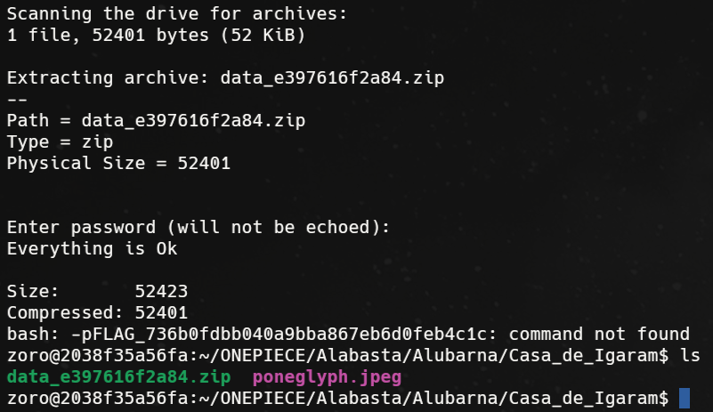

# Reto 1 - Desafío 1: Monkey D. Luffy (XOR)

1. Levantando el contenedor luffy
```bash
docker compose -p onepiece up -d luffy
```


2. Entrando al contenedor
```bash
docker compose -p onepiece exec luffy bash
```


3. Navegando a la carpeta del reto (flags y .zip)
```bash
find ONEPIECE -name "flag.txt" | head -5
find ONEPIECE -name "*.zip" | head -5
```


4. Encontrando los archivos correctos mediante el marcador del carné
```bash
find . -name ".marker_*"
# Resultado:
# ./East_Blue/Arlong_Park/Casa_de_Arlong/.marker_238
# ./East_Blue/Baratie/Casa_de_Zeff/.marker_238
```

- **flag.txt** → `ONEPIECE/East_Blue/Arlong_Park/Casa_de_Arlong/flag.txt`
- **ZIP del Poneglyph** → `ONEPIECE/East_Blue/Baratie/Casa_de_Zeff/data_94519abff613.zip`

5. Extrayendo el ZIP del Poneglyph (requiere p7zip por cifrado AES)
```bash
sudo apt-get install -y p7zip-full
7z x data_94519abff613.zip -ponepiece
```

6. Obteniendo el texto oculto en los metadatos EXIF de la imagen
```bash
python3 -c "import re; data=open('poneglyph.jpeg','rb').read(); [print(t.decode()) for t in re.findall(b'[ -~]{6,}', data)]"
# Primera línea del output (hex cifrado):
# 605d51505912585c50595756134d5f5712604d45534513715646126350455346564a1b12515f585e5f5b5d5e177e47555f4e1245524a1740574049585c415a5b5b5712555645125a564b17515d5d4d5e5c47565d17574a5a4a43575c505c1b
```

7. Descifrando el texto EXIF con XOR usando el carné
```python
key = '22397'
ct = bytes.fromhex('605d51505912585c50595756134d5f5712604d45534513715646126350455346564a1b12515f585e5f5b5d5e177e47555f4e1245524a1740574049585c415a5b5b5712555645125a564b17515d5d4d5e5c47565d17574a5a4a43575c505c1b')
pt = bytes([ct[i] ^ ord(key[i % len(key)]) for i in range(len(ct))])
print(pt.decode())
# Output: Robin joined the Straw Hat Pirates, claiming Luffy was responsible for her continued existence,
```

8. Descifrando el flag.txt con XOR usando el carné
```bash
cat ~/ONEPIECE/East_Blue/Arlong_Park/Casa_de_Arlong/flag.txt
# Output hex: 747e727e680501055b075456515b07060252005550530b0f005750055d075457510d540351
```

```python
key = '22397'
ct = bytes.fromhex('747e727e680501055b075456515b07060252005550530b0f005750055d075457510d540351')
pt = bytes([ct[i] ^ ord(key[i % len(key)]) for i in range(len(ct))])
print(pt.decode())
# FLAG_736b0fdbb040a9bba867eb6d0feb4c1c
```

**Flag:** `FLAG_736b0fdbb040a9bba867eb6d0feb4c1c`

# Reto 2 - Desafío 2: Roronoa Zoro (RC4)

1. Levantando el contenedor zoro
```bash
docker compose -p onepiece up -d zoro_image
docker start zoro_challenge && docker exec -u zoro -it zoro_challenge bash
# Contraseña del usuario zoro: FLAG_736b0fdbb040a9bba867eb6d0feb4c1c (flag reto 1)
```


2. Encontrando los archivos correctos mediante el marcador del carné
```bash
find ONEPIECE -name ".marker_*"
# Resultado:
# ./Alabasta/Alubarna/Casa_de_Igaram/.marker_238
# ./Alabasta/Katorea/Casa_de_Toto/.marker_238
```

- **flag.txt** → `ONEPIECE/Alabasta/Katorea/Casa_de_Toto/flag.txt`
- **ZIP del Poneglyph** → `ONEPIECE/Alabasta/Alubarna/Casa_de_Igaram/data_e397616f2a84.zip`

3. Extrayendo el ZIP del Poneglyph (contraseña: flag reto 1)
```bash
cd ~/ONEPIECE/Alabasta/Alubarna/Casa_de_Igaram/
sudo apt-get update && sudo apt-get install -y p7zip-full
7z x data_e397616f2a84.zip -pFLAG_736b0fdbb040a9bba867eb6d0feb4c1c
```


4. Obteniendo el texto oculto en los metadatos EXIF de la imagen
```bash
python3 -c "import re; data=open('poneglyph.jpeg','rb').read(); [print(t.decode()) for t in re.findall(b'[ -~]{6,}', data)]"
# Primera línea del output (hex cifrado):
# 535c5719434053455c5b5756134e5e465a134d5f575f134d5812615840475b575219405a57415c17535c5c4d5f57401369585c5754554e425a134e5641125b5c5b561c136d5f5740561940534113581745535f55175b5c134d5f57126051565c565c4b5e535c134b425b5c401954404b434d5e51535f554e1256564a54405b51505955
```

5. Descifrando el texto EXIF con XOR usando el carné
```python
key = '22397'
ct = bytes.fromhex('535c5719434053455c5b5756134e5e465a134d5f575f134d5812615840475b575219405a57415c17535c5c4d5f57401369585c5754554e425a134e5641125b5c5b561c136d5f5740561940534113581745535f55175b5c134d5f57126051565c565c4b5e535c134b425b5c401954404b434d5e51535f554e1256564a54405b51505955')
pt = bytes([ct[i] ^ ord(key[i % len(key)]) for i in range(len(ct))])
print(pt.decode())
# Output: and traveled with them to Skypiea where another Poneglyph was held. There was a wall in the Shandorian ruins cryptically describing
```

6. Descifrando el flag.txt con RC4 usando el carné
```bash
cat ~/ONEPIECE/Alabasta/Katorea/Casa_de_Toto/flag.txt
# Output hex: 0ce4feaf3b3b7f83dc7a5bd1ca5d8e5d0c699e7e56a6f5cc31c4dbf1d7f66dab10449f8c02
```

```python
# Referencia: utils/zoro_rc4.py
def KSA(key):
    S = list(range(256))
    j = 0
    for i in range(256):
        j = (j + S[i] + key[i % len(key)]) % 256
        S[i], S[j] = S[j], S[i]
    return S

def PRGA(S, length):
    i = j = 0
    ks = []
    for _ in range(length):
        i = (i + 1) % 256
        j = (j + S[i]) % 256
        S[i], S[j] = S[j], S[i]
        ks.append(S[(S[i] + S[j]) % 256])
    return ks

key = [ord(c) for c in '22397']
ct = bytes.fromhex('0ce4feaf3b3b7f83dc7a5bd1ca5d8e5d0c699e7e56a6f5cc31c4dbf1d7f66dab10449f8c02')
S = KSA(key)
ks = PRGA(S, len(ct))
pt = bytes([ct[i] ^ ks[i] for i in range(len(ct))])
print(pt.decode())
# FLAG_fc278347c746eea4012d5bafde5a5aaa
```

**Flag:** `FLAG_fc278347c746eea4012d5bafde5a5aaa`

# Reto 3 - Desafío 3: Usopp (PRNG Stream Cipher)

1. Levantando el contenedor usopp
```bash
docker compose -p onepiece up -d usopp
docker compose -p onepiece exec usopp bash
# Contraseña del usuario usopp: FLAG_fc278347c746eea4012d5bafde5a5aaa (flag reto 2)
```

2. Encontrando los archivos correctos mediante el marcador del carné
```bash
find ONEPIECE -name ".marker_*"
# Resultado:
# ./Pirate_Island/Pirates_Ship/Casa_de_GolD_Roger/.marker_238
# ./East_Blue/Loguetown/Casa_de_Bell-mère/.marker_238
```

- **flag.txt** → `ONEPIECE/East_Blue/Loguetown/Casa_de_Bell-mère/flag.txt`
- **ZIP del Poneglyph** → `ONEPIECE/Pirate_Island/Pirates_Ship/Casa_de_GolD_Roger/data_7d4a0c9938cc.zip`

3. Extrayendo el ZIP del Poneglyph (contraseña: flag reto 2)
```bash
cd ~/ONEPIECE/Pirate_Island/Pirates_Ship/Casa_de_GolD_Roger/
sudo apt-get install -y p7zip-full
7z x data_7d4a0c9938cc.zip -pFLAG_fc278347c746eea4012d5bafde5a5aaa
```

4. Obteniendo el texto oculto en los metadatos EXIF de la imagen
```bash
python3 -c "import re; data=open('poneglyph.jpeg','rb').read(); [print(t.decode()) for t in re.findall(b'[ -~]{6,}', data)]"
# Primera línea del output (hex cifrado):
# 465a56195b5d51524d5e5d5c13565112465b5c17625d5d5c505e4b4351175b5c134d5f571240585a5712414c595741134d5f5346134d5f571263565957555f40475a41134d5f575f405c5b4457401940574056195e5c41504b5e50575719405b465b17
```

5. Descifrando el texto EXIF con XOR usando el carné
```python
key = '22397'
ct = bytes.fromhex('465a56195b5d51524d5e5d5c13565112465b5c17625d5d5c505e4b4351175b5c134d5f571240585a5712414c595741134d5f5346134d5f571263565957555f40475a41134d5f575f405c5b4457401940574056195e5c41504b5e50575719405b465b17')
pt = bytes([ct[i] ^ ord(key[i % len(key)]) for i in range(len(ct))])
print(pt.decode())
# Output: the location of the Poneglyph in the same runes that the Poneglyphs themselves were inscribed with.
```

6. Leyendo el flag.txt cifrado
```bash
cat ~/ONEPIECE/East_Blue/Loguetown/Casa_de_Bell-mère/flag.txt
# Output hex: a77742694e4b02824c3e3e3087c6dc7e4a6a0e31c94f428c124f26be12fbce85ba4854d96c
```

7. Descifrando el flag.txt — ataque de fuerza bruta a la semilla del PRNG
```
El cifrado Usopp usa random.seed(seed) con semilla fija (0–99999).
Se prueba cada semilla hasta que el texto descifrado empiece con "FLAG_".
```

```python
import random

def generate_keystream(seed, length):
    random.seed(seed)
    return bytes([random.randint(0, 255) for _ in range(length)])

ct = bytes.fromhex('a77742694e4b02824c3e3e3087c6dc7e4a6a0e31c94f428c124f26be12fbce85ba4854d96c')
for seed in range(100000):
    ks = generate_keystream(seed, len(ct))
    pt = bytes([c ^ k for c, k in zip(ct, ks)])
    if pt.startswith(b'FLAG_'):
        print(f'Semilla encontrada: {seed}')
        print(f'Texto descifrado: {pt.decode()}')
        break
```

```
$ python3 solve_usopp.py
Semilla encontrada: 1234
Texto descifrado: FLAG_a0756186112d74600cb1b142a802721e
```

**Flag:** `FLAG_a0756186112d74600cb1b142a802721e`

---

# Reto 4 - Desafío 4: Nami (ChaCha20)

1. Levantando el contenedor nami
```bash
docker compose -p onepiece up -d nami
docker compose -p onepiece exec nami bash
# Contraseña del usuario nami: FLAG_a0756186112d74600cb1b142a802721e (flag reto 3)
```

2. Encontrando los archivos correctos mediante el marcador del carné
```bash
find ONEPIECE -name ".marker_*"
# Resultado:
# ./Alabasta/Katorea/Casa_de_Toto/.marker_238
# ./Skypiea/Pumpkin_Cafe/Casa_de_Gan_Fall/.marker_238
```

- **flag.txt** → `ONEPIECE/Skypiea/Pumpkin_Cafe/Casa_de_Gan_Fall/flag.txt`
- **ZIP del Poneglyph** → `ONEPIECE/Alabasta/Katorea/Casa_de_Toto/data_e864abff7815.zip`

3. Extrayendo el ZIP del Poneglyph (contraseña: flag reto 3)
```bash
cd ~/ONEPIECE/Alabasta/Katorea/Casa_de_Toto/
sudo apt-get install -y p7zip-full
7z x data_e864abff7815.zip -pFLAG_a0756186112d74600cb1b142a802721e
```

4. Obteniendo el texto oculto en los metadatos EXIF de la imagen
```bash
python3 -c "import re; data=open('poneglyph.jpeg','rb').read(); [print(t.decode()) for t in re.findall(b'[ -~]{6,}', data)]"
# Primera línea del output (hex cifrado):
# 46575f555e5c55135f4240465b5c451240564a5253405051524041134d581259565c4712555c505955125556454553415d191273505a5840565a575012465c1970535c137f565e5e1f195f57125b5853125c5c195e56575219405a575d195840125b564012605c5e5240125e58595355565d17465d134b5253515b19435a571369585c5754554e425a13565912465c49175d54137e5e535c47197d53515817
```

5. Descifrando el texto EXIF con XOR usando el carné
```python
key = '22397'
ct = bytes.fromhex('46575f555e5c55135f4240465b5c451240564a5253405051524041134d581259565c4712555c505955125556454553415d191273505a5840565a575012465c1970535c137f565e5e1f195f57125b5853125c5c195e56575219405a575d195840125b564012605c5e5240125e58595355565d17465d134b5253515b19435a571369585c5754554e425a13565912465c49175d54137e5e535c47197d53515817')
pt = bytes([ct[i] ^ ord(key[i % len(key)]) for i in range(len(ct))])
print(pt.decode())
# Output: telling further researchers to keep going forward. According to Gan Fall, he had no idea when or how Roger managed to reach the Poneglyph on top of Giant Jack.
```

6. Leyendo el flag.txt cifrado
```bash
cat ~/ONEPIECE/Skypiea/Pumpkin_Cafe/Casa_de_Gan_Fall/flag.txt
# Output hex: 2fc42267cefd8e9d17e5175f7561015c32efdee37d7a799e840d4811c8f7845bb8a93908cd
```

7. Descifrando el flag.txt con ChaCha20 usando el carné
```
La clave y el nonce se derivan del carné:
  key   = ('22397' * 32)[:32]   → 32 bytes
  nonce = ('22397' * 8)[:8]     → 8 bytes
```

```python
from Crypto.Cipher import ChaCha20

user_id = '22397'
key = (user_id.encode() * 32)[:32]
nonce = (user_id.encode() * 8)[:8]

ct = bytes.fromhex('2fc42267cefd8e9d17e5175f7561015c32efdee37d7a799e840d4811c8f7845bb8a93908cd')
cipher = ChaCha20.new(key=key, nonce=nonce)
pt = cipher.decrypt(ct)
print(pt.decode())
```

```
$ python3 solve_nami.py
FLAG_ddc0c1843ae1303c72c85d39b3de0513
```

**Flag:** `FLAG_ddc0c1843ae1303c72c85d39b3de0513`
