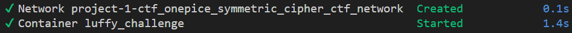
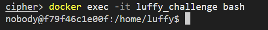
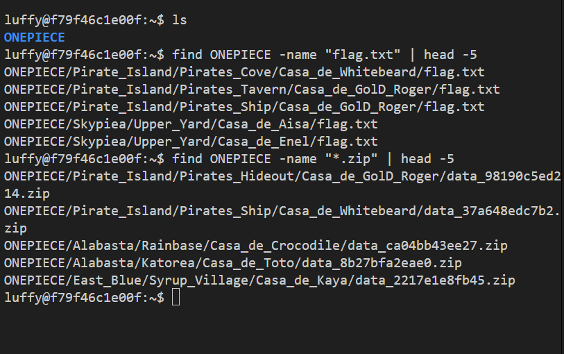

# Reto 1 - Desafío 1: Monkey D. Luffy (XOR)

1. Levantando el contenedor luffy
```bash
docker compose -p onepiece up -d luffy
```


2. Entrando al contenedor
```bash
docker compose -p onepiece exec luffy bash
```


3. Navegando a la carpeta del reto (flags y .zip)
```bash
find ONEPIECE -name "flag.txt" | head -5
find ONEPIECE -name "*.zip" | head -5
```



4. Encontrando los archivos correctos mediante el marcador del carné
```bash
find . -name ".marker_*"
# Resultado:
# ./East_Blue/Arlong_Park/Casa_de_Arlong/.marker_238
# ./East_Blue/Baratie/Casa_de_Zeff/.marker_238
```

- **flag.txt** → `ONEPIECE/East_Blue/Arlong_Park/Casa_de_Arlong/flag.txt`
- **ZIP del Poneglyph** → `ONEPIECE/East_Blue/Baratie/Casa_de_Zeff/data_94519abff613.zip`

5. Extrayendo el ZIP del Poneglyph (requiere p7zip por cifrado AES)
```bash
sudo apt-get install -y p7zip-full
7z x data_94519abff613.zip -ponepiece
```

6. Obteniendo el texto oculto en los metadatos EXIF de la imagen
```bash
python3 -c "import re; data=open('poneglyph.jpeg','rb').read(); [print(t.decode()) for t in re.findall(b'[ -~]{6,}', data)]"
# Primera línea del output (hex cifrado):
# 605d51505912585c50595756134d5f5712604d45534513715646126350455346564a1b12515f585e5f5b5d5e177e47555f4e1245524a1740574049585c415a5b5b5712555645125a564b17515d5d4d5e5c47565d17574a5a4a43575c505c1b
```

7. Descifrando el texto EXIF con XOR usando el carné
```python
key = '22397'
ct = bytes.fromhex('605d51505912585c50595756134d5f5712604d45534513715646126350455346564a1b12515f585e5f5b5d5e177e47555f4e1245524a1740574049585c415a5b5b5712555645125a564b17515d5d4d5e5c47565d17574a5a4a43575c505c1b')
pt = bytes([ct[i] ^ ord(key[i % len(key)]) for i in range(len(ct))])
print(pt.decode())
# Output: Robin joined the Straw Hat Pirates, claiming Luffy was responsible for her continued existence,
```

8. Descifrando el flag.txt con XOR usando el carné
```bash
cat ~/ONEPIECE/East_Blue/Arlong_Park/Casa_de_Arlong/flag.txt
# Output hex: 747e727e680501055b075456515b07060252005550530b0f005750055d075457510d540351
```

```python
key = '22397'
ct = bytes.fromhex('747e727e680501055b075456515b07060252005550530b0f005750055d075457510d540351')
pt = bytes([ct[i] ^ ord(key[i % len(key)]) for i in range(len(ct))])
print(pt.decode())
# FLAG_736b0fdbb040a9bba867eb6d0feb4c1c
```

**Flag:** `FLAG_736b0fdbb040a9bba867eb6d0feb4c1c`
